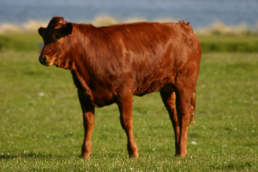
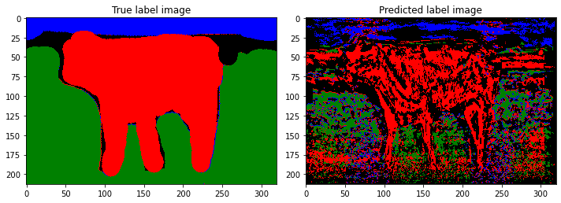
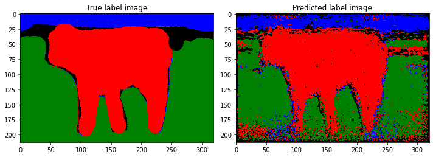

# Segmentation with Random Forest

In this task, Random Forest algorithm was implemented to solve the image segmentation problem. Image segmentation can be considered a classification task where every pixel is mapped to a label based on the information extracted from its N*N neighborhoods.

The aim of this task is to label each pixel in the image with classes `Grass`, `Water`, `Sheep`, `Others` represented with class numbers 3,2,1,0, respectively. The colors assigned to the labels are Green, Blue Red, and Black for the classes above, respectively.

Firstly, patches of size 16*16  are extracted from each training image by making sure to have a balanced dataset. 

Each decision tree is trained with a depth of 15. While training the tree, the information gain is maximized based on entropy. The minimum number of patches at a leaf node is arranged to be at least 20.

Regarding Decision Forest, 5 trees are used to train it and perform segmentation.

Results are provided with the test image `img_12.bmp` using both the decision tree and decision forest.

In the following, input data, ground truth labels, and prediction results are shown.

Test Image:

For decision tree:

For random forest:

